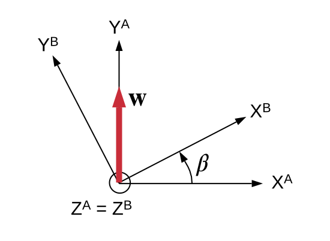
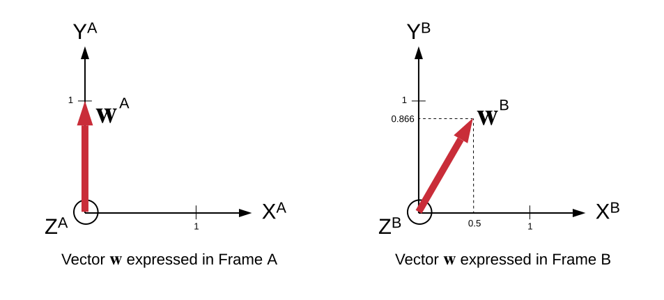

.. _rst_coordinate_frames:

#################
Coordinate Frames
#################

Coordinate Frame Definitions
############################

This document describes the coordinate frames used by NavToolkit and the
relationships between them.  
Many of the frame definitions and notation are consistent with those presented
in [Savage2007]_, but some changes have been made to accommodate a broader
application space than the INS-focused work of Savage.

Standard Coordinate Frames
==========================

These are the coordinate frames that are used throughout NavToolkit.
Note that they are not all Cartesian frames.

* **ECEF Frame** - Earth-centered, earth-fixed frame as defined
  in the `WGS-84 Spec <https://nga-rescue.is4s.us/wgs84fin.pdf>`_\. 
  The Z axis is aligned with the north polar axis, the Y
  axis in the earth equatorial plane, and the X axis in the Greenwich
  meridian plane.  This is a global coordinate frame.

* **NED Frame** - Locally level geographic coordinate frame defined
  with its Z axis downward along the local geodetic vertical, X axis
  north (and horizontal), and Y axis east (and horizontal). Note that
  north and east are undefined at the poles, so the NED frame is
  undefined at the poles.  The term *locally level* means that the attitude
  of this frame is dependent on the position of the origin of the frame.  The
  north and east axes directions are defined to be "locally level" with 
  respect to the WGS-84 ellipsoid at the origin location (meaning that
  they are parallel to the surface of the ellipsoid).  Sometimes a 
  locally level frame is fixed to a single spot on the earth, and 
  in other cases the origin of a locally level frame may be fixed to 
  a vehicle or sensor (such as an INS) which is in motion relative 
  to the earth.  In that case, as the origin moves, the frame definition
  rotates in order to continually maintain the local level characteristics.
  

* **ENU Frame** - Locally level geographic coordinate frame defined
  with its Z axis upward along the local geodetic vertical, Y axis
  north (and horizontal), and X axis east (and horizontal). Note that
  north and east are undefined at the poles, so the ENU frame is
  undefined at the poles.  (Note: the ENU frame is called the "Geo" frame in
  [Savage2007]_.)
  See the definition for the NED frame for a definition of a "locally level"
  frame.

* **N Frame** - Navigation coordinate frame having its Z axis parallel
  to the upward vertical at the local earth surface referenced
  position. The X and Y axes of the N frame are in the local level
  plane and are related to the ENU frame by the wander angle :math:`\alpha`,
  as described below.
  See the definition for the NED frame for a definition of a "locally level"
  frame.
  Note: This frame is consistent with the N frame as defined in [Savage2007]_.

* **S Frame** - Sensor coordinate frame.  This frame represents the coordinate
  frame native to any particular sensor.  
  For example, IMU gyroscope and accelerometer measurements would be expressed
  in the IMU sensor frame.  
  Likewise, a radar Doppler sensor would have its own sensor frame.
  (Note that in [Savage2007]_, this frame is referred to as the B Frame.)

* **P Frame** - Platform frame.  This is a coordinate frame that is defined
  relative to the body of the vehicle, system, or person in which measurements
  are being taken and solutions are being generated.
  An example of a platform frame would be a coordinate frame with the origin at 
  the center of gravity of an aircraft, with the X, Y, and Z axes corresponding 
  to the nose, right wing, and down through the belly directions, respectively.  
  Note that the platform frame is defined according to the need of any
  particular system, and in some cases, the platform frame will be identical to
  the inertial sensor frame.
  However, in the general case, the P Frame is not required to be 
  aligned with any particular sensor.  Note that what we define as the platform 
  frame has been referred to by some as a "body frame".  We have intentionally 
  avoided the use of the term "body" because it can be ambiguous--sometimes it 
  refers to a platform frame, but the term "body frame" can also refer to an
  IMU sensor frame. 

INS-Specific Coordinate Frames
==============================

These are the frames that are used almost exclusively within the inertial
portion of NavToolkit.  They are listed here for completeness.

* **E Frame** - Earth fixed coordinate frame, with Y axis along north
  polar axis, the X axis in the earth equatorial plane, and the Z axis
  in the Greenwich meridian plane. (Note: The E-frame axes are aligned
  with standard WGS-84 ECEF frame axes, but with the axes swapped:
  :math:`X^\text{E} = Y^\text{ECEF}`, :math:`Y^\text{E} = Z^\text{ECEF}`, 
  and :math:`Z^\text{E} = X^\text{ECEF}`. Also note
  that the E frame is defined such that the E-Frame axes are aligned
  with the ENU frame axes when latitude and longitude are both
  0 deg.)  Note: This frame is consistent with the E frame as defined in
  [Savage2007]_.

* **L Frame** - Locally level coordinate frame parallel to the N frame but with
  Z axis parallel to the downward vertical, and X, Y axes along N Frame Y, X
  axes, respectively. 
  This frame is used as the reference for describing the strapdown sensor
  coordinate frame orientation.
  See the definition for the NED frame for a definition of a "locally level"
  frame.
  Note: This frame is consistent with the L frame as defined in [Savage2007]_.

* **I Frame** - Non-rotating inertial coordinate frame used as a reference for
  angular rotation measurements.

The relationship between the four local-level coordinate frames (NED, ENU, N,
L) and :math:`\alpha` is shown below in :numref:`wa_fig`.

.. _wa_fig:

.. figure:: ./figures/WanderAngleDefinitionAll.svg
    :width: 40 %
    :align: center
    :figclass: align-center

    Relationship between local-level coordinate frames and wander angle
    :math:`\alpha`

.. _coordinate_frame_orientation_relationships:

Coordinate Frame Orientation Relationships
##########################################

This section describes some of the key orientation relationships between the
coordinate frames given in the previous section.
These relationships will be expressed by direction cosine matrices.
(See the :ref:`DCM Section <direction_cosine_matrices>` for a description of
notation and characteristics of direction cosine matrices).
First, the ECEF and E frames are related to
each other by swapping axes according to

.. math::

   \textbf{C}_\text{ECEF}^\text{E} =
   \begin{bmatrix}
   0 & 1 & 0\\
   0 & 0 & 1\\
   1 & 0 & 0
   \end{bmatrix}

   \label{eqn:ecef2e}

Likewise, the N frame and L frame are related by
another swapping of axes

.. math::

   \textbf{C}_\text{N}^\text{L} = \textbf{C}_\text{L}^\text{N} =
   \begin{bmatrix}
   0 & 1 & 0\\
   1 & 0 & 0\\
   0 & 0 & -1
   \end{bmatrix}

   \label{eqn:n2l}

as are the ENU and NED frames:

.. math::

   \textbf{C}_\text{ENU}^\text{NED} = \textbf{C}_\text{NED}^\text{ENU} =
   \begin{bmatrix}
   0 & 1 & 0\\
   1 & 0 & 0\\
   0 & 0 & -1
   \end{bmatrix}

   \label{eqn:enu2ned}

The ENU frame is related to the N frame through the
wander angle :math:`\alpha` according to

.. math::

    \textbf{C}_\text{ENU}^\text{N} =
    \begin{bmatrix}
    \cos \alpha & \sin \alpha  & 0 \\
    -\sin \alpha  & \cos \alpha & 0 \\
    0 & 0 & 1
    \end{bmatrix}

    \label{eqn:enu2n}

Next, the direction cosine matrix :math:`C_\text{N}^\text{E}` which describes
the rotation between the N frame and the E frame. This matrix is a function of
latitude :math:`l`, longitude :math:`L`, and wander angle :math:`\alpha`
(Equation 4.4.2.1-2 in [Savage2007]_):

.. math::

    \textbf{C}_\text{N}^\text{E} = \begin{bmatrix}
    c_{11} & c_{12} & c_{13} \\
    c_{21} & c_{22} & c_{23} \\
    c_{31} & c_{32} & c_{33}
    \end{bmatrix}

    \label{eqn:n2e}

where

.. math::

    \begin{aligned}
    c_{11} &= \cos L \cos \alpha - \sin L \sin l \sin \alpha \\
    c_{12} &= -\cos L \sin\alpha -\sin L \sin l \cos \alpha \\
    c_{13} &= \sin L \cos l \\
    \\
    c_{21} &= \cos l \sin \alpha \\
    c_{22} &= \cos l \cos \alpha \\
    c_{23} &= \sin l \\
    \\
    c_{31} &= -\sin L \cos \alpha - \cos L \sin l \sin \alpha \\
    c_{32} &= \sin L \sin \alpha - \cos L \sin l \cos \alpha \\
    c_{33} &= \cos L \cos l
    \end{aligned}

    \label{eqn:n2e_expanded}

All of the orientation relationships between the NED, ENU, N, L, ECEF, and E 
frames can be determined by a combination of the
:math:`\textbf{C}_\text{ECEF}^\text{E}`, :math:`\textbf{C}_\text{N}^\text{L}`,
:math:`\textbf{C}_\text{ENU}^\text{N}`, and
:math:`\textbf{C}_\text{N}^\text{E}` matrices, using the rules of DCM
operations described in the :ref:`DCM Section <direction_cosine_matrices>`.
Some of these additional relationship include

.. math::

    \textbf{C}_\text{E}^\text{ENU} = \begin{bmatrix}
    \cos L   &  0  & -\sin L \\
    -\sin L \sin l & \cos l  & - \cos L \sin l \\
    \sin L \cos l  &  \sin l  & \cos L \cos l
    \end{bmatrix}

    \label{eqn:e2enu}

.. math::

    \textbf{C}_\text{ECEF}^\text{ENU} = \begin{bmatrix}
    -\sin L & \cos L & 0    \\
    - \cos L \sin l & -\sin L \sin l & \cos l \\
    \cos L \cos l& \sin L \cos l & \sin l
    \end{bmatrix}

    \label{eqn:ecef2enu}

Position Representations
########################

This section describes how position can be described in a global
reference frame.

Position Expressed as :math:`\textbf{llh}`
==============================================

This is the standard way to describe coordinates using latitude (:math:`l`, in
some references referred to as :math:`\phi`), longitude (:math:`L`, in some
references referred to as :math:`\lambda`), and height (:math:`h`). These are
all defined relative to the WGS-84 ellipsoid, so :math:`h` is height above the
ellipsoid, and :math:`l` is geodetic latitude. Sometimes the three values will
be given in vector form as

.. math::

    \textbf{llh} \triangleq
    \begin{bmatrix}
        l \\
        L \\
        h
    \end{bmatrix}

    \label{eqn:lladef}

Unless otherwise stated, units are radians (for
:math:`l` and :math:`L`) and meters (for :math:`h`).

Position Expressed as :math:`\textbf{p}^\text{ECEF}`
========================================================

ECEF coordinates describe position in the Cartesian ECEF frame. This is
normally expressed in vector form as

.. math::

    \textbf{p}^\text{ECEF} \triangleq
    \begin{bmatrix}
        p_{x_\text{ECEF}} \\
        p_{y_\text{ECEF}} \\
        p_{z_\text{ECEF}}
    \end{bmatrix}

    \label{eqn:pecef}

Unless otherwise stated, units are in meters.

Position Expressed as :math:`\textbf{C}_\text{N}^\text{E}`, :math:`h`
=========================================================================

Another way to express position is through a combination of the
ellipsoidal height :math:`h` and the :math:`\textbf{C}_\text{N}^\text{E}`
matrix. The values for latitude :math:`l`, longitude :math:`L`, and wander
angle :math:`\alpha` can be extracted from
:math:`\textbf{C}_\text{N}^\text{E}` according to

.. math::

    \begin{aligned}
    l &= \tan^{-1}\begin{pmatrix}
            \dfrac{c_{23}}{\sqrt{c_{21}^2+c_{22}^2}}
        \end{pmatrix} \\
    L &= \tan^{-1}\begin{pmatrix}
            \dfrac{c_{13}}{c_{33}}
        \end{pmatrix} \\
    \alpha &= \tan^{-1}\begin{pmatrix}
            \dfrac{c_{21}}{c_{22}}
        \end{pmatrix}
    \end{aligned}

    \label{eqn:llapha}

where :math:`c_{ab}` is the 1-indexed :math:`(a,b)` element of
:math:`\textbf{C}_\text{N}^\text{E}`. 
The :math:`\textbf{C}_\text{N}^\text{E}` matrix is often used to represent
position rather than :math:`l` and :math:`L`, because :math:`l` and :math:`L`
are singular over the north and south poles, but
:math:`\textbf{C}_\text{N}^\text{E}` is not. Velocity integration into position
involves simply applying a rotation to the :math:`\textbf{C}_\text{N}^\text{E}`
matrix, which works over the poles, avoiding any singularity.

Position Expressed as :math:`\textbf{p}^\text{E}`
=====================================================

This is the same as :math:`\textbf{p}^\text{ECEF}`, except the vector is
expressed in the E frame rather than the ECEF frame. Position expressed as
:math:`\textbf{p}^\text{E}` is normally related to inertial processing, and is
not generally used as a generic way to express position, since the more
standard :math:`\textbf{p}^\text{ECEF}` is to be preferred for this purpose. It
is normally expressed in vector form as

.. math::

    \textbf{p}^\text{E} \triangleq
    \begin{bmatrix}
        p_{x_\text{E}} \\
        p_{y_\text{E}} \\
        p_{z_\text{E}}
    \end{bmatrix}

    \label{eqn:pe}

Unless otherwise stated, units are in meters.
The relationship between :math:`\textbf{p}^\text{E}` and
:math:`\textbf{p}^\text{ECEF}` is

.. math::

    \textbf{p}^\text{E} = \textbf{C}_\text{ECEF}^\text{E}
    \textbf{p}^\text{ECEF}= \begin{bmatrix}
        0 & 1 & 0 \\
        0 & 0 & 1 \\
        1 & 0 & 0
    \end{bmatrix}
    \begin{bmatrix}
        p_{x_\text{ECEF}} \\
        p_{y_\text{ECEF}} \\
        p_{z_\text{ECEF}}
     \end{bmatrix}

    \label{eqn:pe_ecef}

Velocity Representations
########################

This section discusses how velocity can be described in a global
reference frame.

Velocity Expressed as :math:`\textbf{v}^\text{ECEF}`
========================================================

One way to describe velocity is the time rate of change of
:math:`\textbf{p}^\text{ECEF}`\ :

.. math::

    \textbf{v}^\text{ECEF} \equiv \dot{\textbf{p}}^\text{ECEF}

This is
normally expressed as a vector with three components

.. math::

    \textbf{v}^\text{ECEF}=
    \begin{bmatrix}
        v_{x_{\text{ECEF}}} \\
        v_{y_{\text{ECEF}}} \\
        v_{z_{\text{ECEF}}}
    \end{bmatrix}

    \label{eqn:vecef}

Unless otherwise stated, units are in meters/second.

Velocity Expressed as :math:`\textbf{v}^\text{E}`
=====================================================

Velocity can also be expressed as the time rate of change of
:math:`\textbf{p}^\text{E}`:

:math:`\textbf{v}^\text{E} \equiv \dot{\textbf{p}}^\text{E}`

This is normally expressed as a vector with three components

.. math::

    \textbf{v}^\text{E}=
    \begin{bmatrix}
        v_{x_{\text{E}}} \\
        v_{y_{\text{E}}} \\
        v_{z_{\text{E}}}
    \end{bmatrix}

    \label{eqn:ve}

It is related to :math:`\textbf{v}^\text{ECEF}` according to

.. math::

    \textbf{v}^\text{E} =
    \textbf{C}_\text{ECEF}^\text{E} \textbf{v}^\text{ECEF}

Unless otherwise
stated, units are in meters/second.

Velocity Expressed as :math:`\textbf{v}^\text{ENU}`
=======================================================

Another more intuitive way to express velocity is in the ENU frame
(east-north-up). This is normally expressed as a vector with three components

.. math::

    \textbf{v}^\text{ENU}=
    \begin{bmatrix}
        v_{x_{\text{ENU}}} \\
        v_{y_{\text{ENU}}} \\
        v_{z_{\text{ENU}}}
    \end{bmatrix}

    \label{eqn:venu}

This is related to :math:`\textbf{v}^\text{ECEF}` according
to

.. math::

    \textbf{v}^\text{ENU} =
    \textbf{C}_\text{ECEF}^\text{ENU}\textbf{v}^\text{ECEF}

The
:math:`\textbf{C}_\text{ECEF}^\text{ENU}` direction cosine matrix was described
in :ref:`coordinate_frame_orientation_relationships`.
Unless otherwise stated, units are in meters/second.

.. _attitude_representations:

Attitude Representations
########################

Attitude refers to the relative orientation between two coordinate
frames. If one of the frames is a geographically-referenced frame (such
as ECEF), we sometimes refer to attitude as "absolute attitude",
although fundamentally, it's still just relating two different
coordinate frames.

There are several common ways to express relative orientation between
two frames. In this section we will describe five of them:

1. Rotation vector
2. Angle-axis
3. Direction cosine matrix
4. Attitude quaternion
5. Euler angles

There are tradeoffs between each of these, but in general, computation
is most readily done using either direction cosine matrices or
quaternions. Euler angles are useful for human
conceptualization/visualization, but they are highly nonlinear and have
singularities, making them less desirable for computational purposes.
Rotation vectors and angle-axis representations are also good for visualization
and are useful when relating to rotation sensors (like
gyros) which fundamentally output a rotation vector (or rotation rate
vector).

This section summarizes the basics of working with attitude. Refer to
Chapter 3 in [Savage2007]_ for a much more thorough coverage of these
topics.

.. _attitude_expressed_as_rotation_vectors:

Attitude Expressed as Rotation Vectors
======================================

A good description of rotation vectors is given in Section 3.2.2
of [Savage2007]_\, so we will just quote that here:

    Another way of describing the attitude of an arbitrary coordinate
    Frame B relative to another arbitrary coordinate Frame A is through
    the \"rotation vector\" concept. The \"rotation vector\" defines an
    axis of rotation and magnitude for a rotation about the rotation
    vector (using the standard right hand convention for rotation about a
    vector). Imagine frame A being rotated from its starting attitude to a
    new attitude by rotation about the \"rotation vector\" through an
    angle equal to the rotation vector magnitude. Now call Frame B the new
    attitude of Frame A. By this definition of Frame B, an arbitrarily
    defined rotation vector uniquely defines the attitude of Frame B
    relative to the original Frame A attitude. Conversely, for a given
    Frame B attitude, relative to Frame A, a rotation vector can be
    defined that is consistent with this attitude. Thus a rotation vector
    can be used to define the attitude of Frame B relative to Frame A.

We will denote a three dimensional rotation vector as 

.. math::

    \pmb{\phi} =  \begin{bmatrix}
        \phi_x \\
        \phi_y \\
        \phi_z
    \end{bmatrix}

    \label{eqn:phi_xyz}

It is interesting to note that a rotation vector that rotates Frame
A to become Frame B is identical when expressed in either Frame A or Frame B.
That is,

.. math::

    \pmb{\phi} = \pmb{\phi}^\text{A} = \pmb{\phi}^\text{B}

where :math:`\pmb{\phi}^\text{A}` is the rotation vector expressed in Frame A
and :math:`\pmb{\phi}^\text{B}` is the rotation vector expressed in Frame B.
Because they are identical, there is no need to specify the frame.

Unless otherwise specified, :math:`\phi` will be expressed in units of radians.

.. _rotation_angle_example:

:numref:`fig_frame_rotation` shows a simple example of two different Cartesian
coordinate frames that are related by rotation vector

.. math::

    \pmb{\phi} =  \begin{bmatrix}
        0 \\
        0 \\
        \beta
    \end{bmatrix}

    \label{eqn:phi_example}

.. _fig_frame_rotation:

    Frame Rotation Example (:math:`\pmb{\phi} = [0,0,\beta]^T`)

Note that :math:`\pmb{\phi}` vector describes a coordinate frame rotation.
This is related to, but is not the same as the rotation that is required to
transform a vector expressed in frame A to that same vector expressed in
frame B. A more detailed discussion of this difference can be found in
the :ref:`appendix`.

Attitude Expressed in Axis-Angle Form
=====================================

Rather than express the rotation vector as a scaled vector as described in the 
previous section, it is often useful to express it in axis-angle form.
Starting with a rotation vector :math:`\pmb{\phi}`  we can define

.. math::

    \pmb{\phi} = \phi \textbf{u}_{\phi}

.. math::

    \phi = \sqrt{\pmb{\phi} \cdot \pmb{\phi}}

.. math::

    \textbf{u}_{\phi} = \pmb{\phi}/{\phi}

where

.. math::

    \begin{aligned}
    \phi &= \text{Magnitude of the rotation vector} \\
    \textbf{u}_{\phi} &=
    \text{Unit vector in the rotation vector direction}\end{aligned}

A rotation 
vector as described above would be expressed in axis-angle form as

.. math::

    \left( \textbf{u}_\phi, \phi \right)

Note that the unit vector is undefined when :math:`\phi=0`.  Unless otherwise
specified, :math:`\phi` will be expressed in radians.
(The vector :math:`\textbf{u}_\phi` is unitless.)

Using the previous example, the rotation vector 

.. math::

    \pmb{\phi} =  \begin{bmatrix}
        0 \\
        0 \\
        \beta
    \end{bmatrix}

    \label{eqn:phi_example2}

expressed in axis-angle form would be 

.. math::

    \left(
    \begin{bmatrix}
        0 \\
        0 \\
        1
    \end{bmatrix}, \beta \right)

    \label{eqn:angle_axis}

.. _direction_cosine_matrices:

Attitude Expressed as Direction Cosine Matrices
===============================================

A direction cosine matrix (DCM) is a `3x3` matrix that describes
a rotation between two frames. By way of notation, a DCM that rotates an
arbitrary vector :math:`\textbf{w}` expressed in frame X
(:math:`\textbf{w}^\text{X}`) to the same vector expressed in frame Y
(:math:`\textbf{w}^\text{Y}`) is expressed
as :math:`\textbf{C}_\text{X}^\text{Y}`:

.. math::

    \textbf{w}^\text{Y} = \textbf{C}_\text{X}^\text{Y}\textbf{w}^\text{X}

Direction cosine
matrices are orthonormal matrices and have the characteristics

.. math::

    \textbf{C}_\text{Y}^\text{X} = (\textbf{C}_\text{X}^\text{Y})^T =
    (\textbf{C}_\text{X}^\text{Y})^{-1}

.. math::

    \textbf{C}_Z^\text{X} = \textbf{C}_\text{Y}^\text{X}\textbf{C}_Z^\text{Y}

With 9 elements, a direction cosine matrix
has redundant information, but it is convenient for rotating vectors
between different frames.

The direction cosine matrix relating Frame A to Frame B can be expressed in
terms of the rotation vector :math:`\pmb{\phi}` as

.. math::

    \textbf{C}_\text{B}^\text{A} = I
    +\frac{\sin\phi}{\phi}\left(\pmb{\phi}\times \right)
    +\frac{(1-\cos \phi)}{\phi^2}
    \left(\pmb{\phi}\times \right)\left(\pmb{\phi}\times \right)

    \label{eqn:rotvec2dcm}

where :math:`\left(\pmb{\phi}\times \right)` is the cross product operator made
up of the components of :math:`\pmb{\phi}`:

.. math::

    \left(\pmb{\phi}\times \right)=\begin{bmatrix}
    0 & -\phi_z & \phi_y \\
    \phi_z & 0 & -\phi_x \\
    -\phi_y & \phi_x & 0
    \end{bmatrix}

    \label{eqn:phi_cross}

Note that the DCM :math:`\textbf{C}_\text{B}^\text{A}` describes the vector
rotation to transform a vector from frame B to frame A:

.. math::

    \textbf{w}^\text{A} = \textbf{C}_\text{B}^\text{A} \textbf{w}^\text{B}

    \label{eqn:rotb_to_a}

Attitude Expressed as Quaternions
=================================

In general, quaternions are represented in the form

.. math::

    a+b\textbf{i}+c\textbf{j}+d\textbf{k}

where :math:`a`, :math:`b`, :math:`c`, and :math:`d`
are real numbers and :math:`\textbf{i}`, :math:`\textbf{j}`, and
:math:`\textbf{k}` are quaternion units. An attitude quaternion is a specially
defined quaternion that has unit length and which expresses a rotation defined
by rotation vector :math:`\pmb{\phi}`. The components of the attitude
quaternion are

.. math::

    \textbf{q} = \begin{bmatrix}
        a \\ b \\ c \\ d
    \end{bmatrix}

    \label{eqn:quat_def}

where

.. math::

    a=\cos\frac{\phi}{2} \qquad
    b = \frac{\phi_x}{\phi}\sin \frac{\phi}{2} \qquad
    c = \frac{\phi_y}{\phi}\sin \frac{\phi}{2}  \qquad
    d = \frac{\phi_z}{\phi}\sin \frac{\phi}{2}

    \label{eqn:abcd_def}

where :math:`\phi_x`,
:math:`\phi_y`, and :math:`\phi_z` are the components of :math:`\pmb{\phi}`.

It should be noted that sometimes a quaternion is represented as 

.. math::

    \textbf{q}_{alt} = \begin{bmatrix}
        b \\ c \\ d \\ a
    \end{bmatrix}

    \label{eqn:qalt}

(In other words, the ordering of the cosine and sine terms are switched.)  
This is an arbitrary convention, and we have chosen to represent quaternions 
consistently using the
:math:`\textbf{q} = [\begin{matrix} a & b & c & d ]\end{matrix}^T` convention.

It is helpful to define some quaternion operations. If :math:`\textbf{q}` is
defined as above, then the quaternion conjugate :math:`\textbf{q}^*` is

.. math::

    \textbf{q}^* = \begin{bmatrix}
        a \\ -b \\ -c \\ -d
    \end{bmatrix}

    \label{eqn:qalt_mat}

If there are two attitude quaternions describing
rotation between frames A and B and rotations between frames B and C,
quaternion multiplication can be used to calculate the attitude
quaternion between A and C:

.. math::

    \textbf{q}_\text{B}^\text{A} = \begin{bmatrix}
        a \\ b \\ c \\ d
    \end{bmatrix}
    \qquad
    \textbf{q}_C^\text{B} = \begin{bmatrix}
        e \\ f \\ g \\ h
    \end{bmatrix}

    \label{eqn:qmult2}

.. math::

    \begin{aligned}
        \textbf{q}_C^\text{A} &=
        \textbf{q}_\text{B}^\text{A}\textbf{q}_C^\text{B} \\
        &= \begin{bmatrix}
            ae-bf-cg-dh \\
            be+af-dg+ch \\
            ce+df+ag-bh \\
            de-cf+bg+ah
        \end{bmatrix}   \\
        &=\begin{bmatrix}
            a & -b & -c & -d \\
            b & a & -d & c \\
            c & d & a & -b \\
            d & -c & b & a
        \end{bmatrix}
        \begin{bmatrix}
            e \\ f \\ g \\ h
        \end{bmatrix}
    \end{aligned}

    \label{eqn:qmult_details}

The "direction" of the quaternion
rotation can be reversed by taking the quaternion conjugate:

.. math::

    \textbf{q}_\text{A}^\text{B} =
    \begin{pmatrix}
    {\textbf{q}_\text{B}^\text{A}}
    \end{pmatrix}^*

    \label{eqn:qconj}

Finally, note that for small rotation angle
magnitudes, elements b-d of the quaternion are approximately :math:`1/2` of
the rotation vector.

The direction cosine matrix :math:`\textbf{C}_\text{B}^\text{A}` corresponding 
to the :math:`\textbf{q}_\text{B}^\text{A}` quaternion as described above is
[Savage2007]_

.. math::

    \textbf{C}_\text{B}^\text{A} = \begin{bmatrix}
        (a^2+b^2-c^2-d^2) & 2(bc-ad) & 2(bd+ac) \\
        2(bc+ad) & (a^2-b^2+c^2-d^2) & 2(cd-ab) \\
        2(bd-ac) & 2(cd+ab) & (a^2-b^2-c^2+d^2)
    \end{bmatrix}

    \label{eqn:q_to_dcm}

Attitude Expressed as Euler Angles
==================================

Euler angles represent relative orientation between two coordinate frames by a
sequence of three rotations about individual axes.
After the first rotation, the second and third rotations operate on *rotated*
coordinate frames, which makes Euler angle approaches very nonlinear.
Additionally, at particular attitudes Euler angles have a singularity which
makes them become undefined.
As a result, Euler angles are almost never used as a way to computationally
maintain or propagate knowledge of attitude.
However, Euler angles are perhaps the most "human understandable" attitude
parameters, so they are often used as a way to express attitude or to take in
attitude inputs by human interaction.

The most common Euler angle sequence is a 3-2-1 frame rotation by angles
:math:`\Psi` (heading or yaw), :math:`\theta` (pitch), and :math:`\phi` (roll).
In other words, starting with frame A, we perform a frame rotation as follows:

1. Rotate frame A about third axis of frame A by value of yaw (:math:`\Psi`)
   to yield intermediate frame 1
2. Rotate intermediate frame 1 about its second axis by value of pitch
   (:math:`\theta`) to yield intermediate frame 2
3. Rotate intermediate frame 2 about its first axis by value of roll
   (:math:`\phi`) to yield frame B

It is called a "3-2-1" rotation, because that is the order in which each of the
axes are rotated (rotation about 3rd, then 2nd, then first axis).

The direction cosine matrix that describes the relationship between Frames A
and B as described above is 

.. math::

    \textbf{C}_\text{B}^\text{A} = \begin{bmatrix}
        c_{11} & c_{12} & c_{13} \\
        c_{21} & c_{22} & c_{23} \\
        c_{31} & c_{32} & c_{33}
    \end{bmatrix}

    \label{eqn:cba_terms}

where

.. math::

    \begin{aligned}
        c_{11} &= \cos\theta\cos\Psi \\
        c_{12} &= -\cos\phi\sin\Psi + \sin\phi\sin\theta\cos\Psi \\
        c_{13} &= \sin\phi\sin\Psi + \cos\phi\sin\theta\cos\Psi \\
        \\
        c_{21} &= \cos\theta\sin\Psi \\
        c_{22} &= \cos\phi\cos\Psi + \sin\phi\sin\theta\sin\Psi \\
        c_{23} &= -\sin\phi\cos\Psi + \cos\phi\sin\theta\sin\Psi \\
        \\
        c_{31} &= -\sin\theta \\
        c_{32} &=  \sin\phi\cos\theta \\
        c_{33} &= \cos\phi\cos\theta \\
    \end{aligned}

    \label{eqn:cba_details}

Note that the description above described a frame rotation from Frame A to
Frame B, but this is the same as performing a vector rotation to rotate a
vector from frame B to frame A (hence the :math:`\textbf{C}_\text{B}^\text{A}`
notation).  See the :ref:`appendix` for a more detailed explanation.

A common use for Euler angles is to describe the orientation of a vehicle (such
as an aircraft) or the orientation of inertial sensors relative to the NED
frame.
If the aircraft frame (what we would call a "platform frame") is defined as +X
through the nose, +Y through the right wing, and +Z down, then an aircraft
flying straight and level to the north will have all zeroes for the Euler
angles, and non-zero Euler angle values for an aircraft at any other attitude.
This is the situation in which we normally
picture the concepts of "roll", "pitch", and "yaw".  

It is possible to define an Euler angle sequence between frames which are not
aligned when a vehicle or sensor is in a nominal orientation (such as straight
and level flying north).  
An example of such a case would be to define the orientation of an aircraft
platform frame (as defined above) relative to an ENU frame. However, in this
case a "zero-rotation" situation (all Euler angles zero) is one in which the
aircraft is flying upside-down to the east, which is *not* what is mentally
pictured by "zero rotation".  
As a result, we generally reserve the use of Euler angles to describe the
orientation of a vehicle or sensor, expressed in a "forward-right-down" 
like coordinate frame, relative to the NED frame.

References
##########

.. [Savage2007] Savage, P.G. *Strapdown Analytics II, Part 1*. Strapdown Associates, Inc., 2007

.. _appendix:

Appendix: Coordinate Frame Rotations vs. Vector Rotations
#########################################################

There can be significant confusion regarding attitude, and one common point of
confusion is understanding the difference between rotating a coordinate frame
and rotating a vector to transform between frames.  In the definition of
rotation vectors given in the previous section, the rotation vector
:math:`\pmb{\phi}` describes the rotation that would rotate a Cartesian
coordinate frame A in order to turn it into coordinate frame B.
This can be thought of as
rotating all of the orthogonal basis vectors (coordinate axes) from frame A by
the rotation vector to get frame B.  From the example given in :ref:`the
rotation angle example<rotation_angle_example>`, Frame B is defined by rotating
frame A by the rotation vector :math:`\pmb{\phi} = [0,0,\beta]^T`. More
specifically, the basis vectors for frame A are rotated by :math:`\pmb{\phi}`
to get the basis vectors of frame B.  Therefore, the rotation vector defines
the *frame rotation* to go from frame A to frame B.

However, when using different coordinate frames, we often want to take a vector
expressed in one frame and transform it to be represented in a different frame.
Let's consider an example of a vector :math:`\textbf{w}` as shown in
:numref:`fig_framerotationwithw`:

.. _fig_framerotationwithw:

    Frame Rotation Example (:math:`\pmb{\phi} = [0,0,\beta]^T`)

In this example, :math:`\textbf{w}` can be expressed in frame A as  

.. math::

    \textbf{w}^\text{A}=
    \begin{bmatrix}
        0 \\
        1 \\
        0 \\
    \end{bmatrix}

    \label{eqn:wa}

The same vector, expressed in frame B, is

.. math::

    \textbf{w}^\text{B}
    =\begin{bmatrix}
        \sin \beta \\
        \cos \beta \\
        1 \\
    \end{bmatrix}
    =\begin{bmatrix}
        0.5 \\
        0.866 \\
        1 \\
    \end{bmatrix}

    \label{eqn:wb}

The vector :math:`\textbf{w}` is rendered separately in frames A and B in
:numref:`fig_abcompare`:

.. _fig_abcompare:

    Vector :math:`\textbf{w}` expressed in Frames A and B

In this case, the *frame rotation* is done by rotating the coordinate
frame axes about the rotation vector :math:`[0, 0, \beta]^T` (which is how we
originally defined the rotation vector in
:ref:`attitude_expressed_as_rotation_vectors`).
However, if we start with the vector :math:`\textbf{w}` expressed in frame A
(:math:`\textbf{w}^\text{A}`), and want to transform it so that it is
expressed in frame B (:math:`\textbf{w}^\text{B}`), we actually have to rotate
the vector in the *opposite* direction as the frame rotation--in this case,
we rotate :math:`\textbf{w}^\text{A}` by the rotation vector
:math:`[0, 0, -\beta]^T` to obtain :math:`\textbf{w}^\text{B}`.  We can also go
in the opposite direction, starting with the vector
:math:`\textbf{w}^\text{B}`, and rotating it about the original vector which 
defines the frame rotation :math:`[0, 0, \beta]^T` in order to obtain
:math:`\textbf{w}^\text{A}`.

So, in effect, the same rotation vector :math:`\pmb{\phi}` defines the
*frame rotation* from frame A to frame B and the *vector rotation* to rotate
from :math:`\textbf{w}^\text{B}` to :math:`\textbf{w}^\text{A}`.
In practice, these two ways of expressing attitude (as a frame rotation or a
vector rotation) are equivalent--they are just different ways of representing
the same thing.

By convention, some ways of expressing attitude tend to be expressed using
frame rotations, and others tend to be expressed using vector rotations.  Here
are the conventions used in this tutorial:

- **Rotation Vectors** - frame rotation from A to B
- **Angle-Axis** - frame rotation from A to B
- **Direction Cosine Matrices** - vector rotation from B to A 
- **Quaternions** - both: defined using frame rotation from A to B, but often
  used to express vector rotations from B to A 
- **Euler Angles** - define a frame rotation from A to B

All of the attitude representations expressed in this document are consistent
with each other in terms of how they represent the two arbitrary frames A and
B, even though they follow different (but fairly standard) conventions of how
these transformations are described.