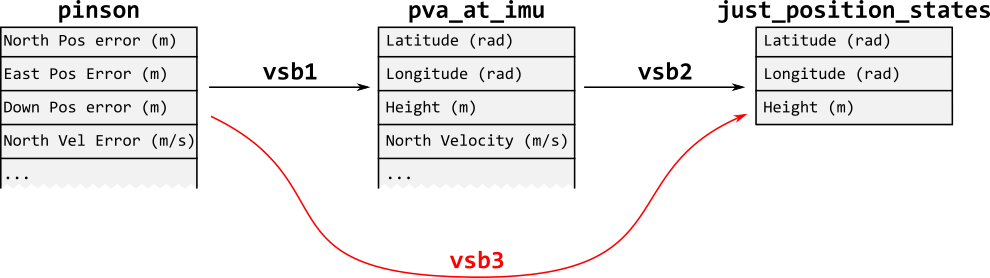

.. _rst_virtual_state_blocks:

Using Virtual State Blocks
==========================

What is a Virtual State Block?
-------------------------------
A :class:`~navtk::filtering::VirtualStateBlock` (VSB) is a class that converts a
state estimate and covariance from one representation to another. These
alternative state representations can then be used to simplify some operations
that a user would normally need to do 'manually', such as producing solutions
for output, forming error state updates, or doing lever arm and frame
corrections between different points on a vehicle.

In NavToolkit, a :class:`~navtk::filtering::StateBlock` is a class that is used
to represent some value being estimated, but it does not directly hold the
actual estimate :math:`\mathbf{\hat{x}}` and covariance :math:`\mathbf{P}`.
Rather, these values are managed internally by a fusion engine like
:class:`~navtk::filtering::StandardFusionEngine` and the estimate and
covariance corresponding to a :class:`~navtk::filtering::StateBlock` are
obtained by the user by (for example) querying the engine's
:func:`~navtk::filtering::StandardFusionEngine::get_state_block_estimate`
function using the :class:`~navtk::filtering::StateBlock`'s
:func:`label <navtk::filtering::StateBlock::get_label>`.

A :class:`~navtk::filtering::VirtualStateBlock` enables the engine to represent
existing states in a different way, by providing a mapping function
:math:`\mathbf{f(\hat{x})}` (
:func:`VirtualStateBlock::convert_estimate <navtk::filtering::VirtualStateBlock::convert_estimate>`) and its
Jacobian :math:`\mathbf{J}` (
:func:`VirtualStateBlock::jacobian <navtk::filtering::VirtualStateBlock::jacobian>`), the partial
derivative of :math:`\mathbf{f(\hat{x})}` evaluated at
:math:`\mathbf{\hat{x}}`, :math:`\frac{\partial f(\mathbf{\hat{x}})}{\delta
\mathbf{\hat{x}}}|_{\mathbf{\hat{x}}}`. Using these functions, the fusion
engine computes the current value of the
:class:`~navtk::filtering::VirtualStateBlock`\'s states on demand, based on the
value of other states it's estimating.

Comparing and Contrasting State Blocks and Virtual State Blocks
---------------------------------------------------------------

Neither :class:`~navtk::filtering::StateBlock`\s nor
:class:`~navtk::filtering::VirtualStateBlock`\s actually contain a state
estimate (:math:`\mathbf{\hat{x}}`) or covariance (:math:`\mathbf{P}`) -- these
come from the engine's
:func:`~navtk::filtering::StandardFusionEngine::get_state_block_estimate` and
:func:`~navtk::filtering::StandardFusionEngine::get_state_block_covariance`
respectively -- but both implicitly define what 'their' state vector must
look like via their respective functions' outputs. For example, the
:member:`~navtk::filtering::StandardDynamicsModel::Phi` produced by
:func:`~navtk::filtering::StateBlock::generate_dynamics` implies the length, order,
and units of the associated state vector by virtue of the length, order, and
units of its diagonal elements. A similar argument applies to
:class:`~navtk::filtering::VirtualStateBlock`\ s
:func:`~navtk::filtering::VirtualStateBlock::jacobian`, though two state
vectors are involved in this case: the state vector to be transformed, and the
result.

Both :class:`~navtk::filtering::StateBlock` and
:class:`~navtk::filtering::VirtualStateBlock` are not usually interacted with
directly after creation and passing to an engine, but are instead referenced
using a string ``label``.

While a :class:`~navtk::filtering::StateBlock` is referenced using the single
:func:`label <navtk::filtering::StateBlock::get_label>` attached to it, a
:class:`~navtk::filtering::VirtualStateBlock` has two labels:

1. :member:`~navtk::filtering::VirtualStateBlock::current` (for the source
   representation) referring to the :class:`~navtk::filtering::StateBlock` (or
   another :class:`~navtk::filtering::VirtualStateBlock`) that provides the
   input :math:`\mathbf{\hat{x}}` and :math:`\mathbf{\hat{P}}` to be
   converted.

2. :member:`~navtk::filtering::VirtualStateBlock::target` to refer to the
   converted values. When a filter implementation fully supports
   :class:`~navtk::filtering::VirtualStateBlock`, a user is able to retrieve
   the :class:`~navtk::filtering::VirtualStateBlock`\ s state and covariance
   representations :math:`\mathbf{\hat{x}_{vsb}}` and :math:`\mathbf{P_{vsb}}`
   by querying the filter using the
   :member:`~navtk::filtering::VirtualStateBlock::target` label.

The 'core' of each is a function that transforms the state vector, but the
transformations are different. A :class:`~navtk::filtering::StateBlock`
transforms the state vector over time; its
:member:`~navtk::filtering::StandardDynamicsModel::g` function takes an estimate
:math:`x_t` at a given time and returns :math:`g(x_t) \rightarrow x_{t+1}`, the
expected estimate at a future time, keeping the semantic meaning of the states
intact, including units and frames. For the
:class:`~navtk::filtering::VirtualStateBlock`, the
:func:`~navtk::filtering::VirtualStateBlock::convert_estimate` function
changes units, frame, or other semantic meaning of the states, but keeps the
time of validity :math:`t` intact.

How to Configure a Virtual State Block
--------------------------------------
To properly use a :class:`~navtk::filtering::VirtualStateBlock`:

1. Figure out what units/frames your desired
   :class:`~navtk::filtering::VirtualStateBlock` states need to be in.

2. Identify an estimate and covariance source to form the basis of the
   :class:`~navtk::filtering::VirtualStateBlock`. This can be from an existing
   :class:`~navtk::filtering::StateBlock` or another
   :class:`~navtk::filtering::VirtualStateBlock`.

3. Determine the :member:`~navtk::filtering::VirtualStateBlock::current` label
   to use. This will either be a :class:`~navtk::filtering::StateBlock`'s
   :func:`label <navtk::filtering::StateBlock::get_label>` or another
   :class:`~navtk::filtering::VirtualStateBlock`'s
   :func:`target <navtk::filtering::VirtualStateBlock::get_target>` and derived
   from the selection made in step 2.

4. Determine if an existing :class:`~navtk::filtering::VirtualStateBlock` can
   perform the conversion; if not,
   :ref:`implement one <Implementing Custom Vsb>`.

5. Create the :class:`~navtk::filtering::VirtualStateBlock` and add it to the
   filter.

6. Get the :class:`~navtk::filtering::VirtualStateBlock` values as you would
   with a normal :class:`~navtk::filtering::StateBlock`, using the
   :func:`target <navtk::filtering::VirtualStateBlock::get_target>` label
   to retrieve them from the engine.

We have a number of off-the-shelf :class:`~navtk::filtering::VirtualStateBlock`
s that handle common conversions relating to inertial error states, lever arm
corrections and unit conversions, some of which are described in the
:ref:`examples <Some Vsb Examples>` below. You can also
:ref:`implement your own VSB <Implementing Custom Vsb>`.

Aside: Chaining
~~~~~~~~~~~~~~~
As the only prerequisite to form a :class:`~navtk::filtering::VirtualStateBlock`
is that an existing basis state and covariance must be available, it is possible
to 'chain' :class:`~navtk::filtering::VirtualStateBlock` conversions together.
This allows a user to break down a more complicated conversion into
smaller, more tractable constituents which has the additional benefit of making
more VSB representations available. No special actions are needed to perform
chaining outside of the steps outlined above; one just needs to ensure that VSB
labels 'link' together and the output states of one match the expected input
states of the other::

    auto vsb1 = VirtualStateBlock("a", "b", ...);

    // After added to filter can call filter.get_state_block_estimate("c"),
    // which will return the result of vsb2.convert_estimate(vsb1.convert_estimate(filter.get_state_block_estimate("a")))
    // (convert_estimate aspn_xtensor::TypeTimestamp arguments removed for clarity)
    auto vsb2 = VirtualStateBlock("b", "c", ...);

Also, it is acceptable to build multiple
:class:`~navtk::filtering::VirtualStateBlock`\ s off of the same source block,
but having multiple 'paths' to a :class:`~navtk::filtering::VirtualStateBlock`
is currently not supported::

    auto vsb1 = VirtualStateBlock("pinson", "pva_at_imu", ...);

    // OK
    auto vsb2 = VirtualStateBlock("pva_at_imu", "just_position_states", ...);

    // Cannot do this if vsb2 exists, because more than one path would
    // provide the label just_position_states.
    auto vsb3 = VirtualStateBlock("pinson", "just_position_states"...);

In other words, if one were to draw a graph of all
:class:`~navtk::filtering::StateBlock`
:func:`labels <navtk::filtering::StateBlock::get_label>`,
:class:`~navtk::filtering::VirtualStateBlock`
:member:`targets <navtk::filtering::VirtualStateBlock::target>` and
:class:`~navtk::filtering::VirtualStateBlock`
:member:`currents <navtk::filtering::VirtualStateBlock::current>`
that are linked via chained VSBs, the graph may branch, but may not form a
closed loop.

    Visualizing a chain of virtual state blocks as a graph. vsb3 is not allowed
    because vsb2 already exists.

.. _Implementing Custom Vsb:

Implementing a Custom Virtual State Block
------------------------------------------
A subclass of :class:`~navtk::filtering::VirtualStateBlock` must define mapping
function :math:`\mathbf{f(\hat{x})}` and the Jacobian :math:`\mathbf{J}` by
overriding the ``virtual`` methods
:func:`~navtk::filtering::VirtualStateBlock::convert_estimate` and
:func:`~navtk::filtering::VirtualStateBlock::jacobian`, respectively. These will
be used by the fusion engine to generate the :class:`~navtk::filtering::VirtualStateBlock`'s
state estimate :math:`\mathbf{\hat{x}_{vsb}}` and covariance :math:`\mathbf{P_{vsb}}`.

Given an original estimate :math:`\mathbf{\hat{x}}` and covariance
:math:`\mathbf{P}`, which will be the fusion engine's estimate and covariance
for the :member:`~navtk::filtering::VirtualStateBlock::current` label, the
:class:`~navtk::filtering::VirtualStateBlock` representations
:math:`\mathbf{\hat{x}_{vsb}}` and :math:`\mathbf{P_{vsb}}` are calculated as:

.. math::
   \mathbf{\hat{x}_{vsb}} = \mathbf{f(\hat{x})}
   \label{eqn:vsb_fx}

.. math::
   \mathbf{P_{vsb}} = \mathbf{JPJ}^T
   \label{eqn:vsb_jac}

Implementing the :func:`~navtk::filtering::VirtualStateBlock::convert_estimate`
and :func:`~navtk::filtering::VirtualStateBlock::jacobian` functions is similar
to implementing a
:func:`MeasurementProcessor::generate_model <navtk::filtering::MeasurementProcessor::generate_model>`
function. There, you define a function :member:`~navtk::filtering::StandardMeasurementModel::h`
and its Jacobian :member:`~navtk::filtering::StandardMeasurementModel::H` that
map a state estimate and covariance to a measurement vector
:member:`~navtk::filtering::StandardMeasurementModel::z`; with
:class:`~navtk::filtering::VirtualStateBlock`\s you define a function and
Jacobian that maps a state estimate and covariance to an alternative state
representation.

The convenience class :class:`~navtk::filtering::FirstOrderVirtualStateBlock`
can be used instead of :class:`~navtk::filtering::VirtualStateBlock` and
allows the user to supply only the mapping function
:math:`\mathbf{f(\hat{x})}`. It uses numerical methods to calculate the Jacobian.

.. _Some Vsb Examples:

Some Examples
-------------
Scalar Unit Conversion
~~~~~~~~~~~~~~~~~~~~~~
Assume we have a single state that is estimating speed over ground in units of
meters-per-second (m/s), and a sensor that measures the same quantity but in
feet-per-second (ft/s). We would normally just enable an update with this
measurement by creating a new :class:`~navtk::filtering::MeasurementProcessor` and defining:

.. math::
    \mathbf{\hat{z}} = 3.28084\mathbf{\hat{x}} \\
    H = 3.28084

If the real :class:`~navtk::filtering::StateBlock` has a
:func:`label <navtk::filtering::StateBlock::get_label>` ``"speed_meters"``, we
can implement a new :class:`~navtk::filtering::VirtualStateBlock` as:

.. literalinclude:: ../src/vsb_custom.cpp
   :language: C++

Or, alternatively using the :class:`~navtk::filtering::FirstOrderVirtualStateBlock`:

.. literalinclude:: ../src/vsb_first_order.cpp
   :language: C++
   :start-after: CREATE_VSB
   :end-before: END

and then provide it to the filter:

.. literalinclude:: ../src/vsb_first_order.cpp
   :language: C++
   :start-after: ADD_TO_FILTER
   :end-before: END

This now enables us to reference either the :class:`~navtk::filtering::StateBlock`
using the ``"speed_meters"`` :func:`label <navtk::filtering::StateBlock::get_label>`,
or the :class:`~navtk::filtering::VirtualStateBlock` with the
:func:`target <navtk::filtering::VirtualStateBlock::get_target>`
``"speed_feet"``. Using the latter lets us use the off-the-shelf
:class:`~navtk::filtering::DirectMeasurementProcessor` as the state and
measurement units are the same:

.. literalinclude:: ../src/vsb_first_order.cpp
   :language: C++
   :start-after: CREATE_MP
   :end-before: END

In this case, the use of a :class:`~navtk::filtering::VirtualStateBlock`
is likely overkill, but a more complicated relationship between the state and
the measurement can benefit greatly from being broken into simple, composable
transformations.

Vector Unit Conversion with FirstOrderVirtualStateBlock
~~~~~~~~~~~~~~~~~~~~~~~~~~~~~~~~~~~~~~~~~~~~~~~~~~~~~~~
We start by assuming that we have a :class:`~navtk::filtering::StateBlock`
modeling 3 position states: latitude, longitude and altitude in radians,
radians and meters. We wish to convert these to Earth-Centered-Earth-Fixed
(ECEF) coordinates. We identify an existing navutils function,
:func:`~navtk::navutils::llh_to_ecef`, that can do this conversion. Luckily,
it also accepts and returns :type:`~navtk::Vector`, which is the exact format
we need (otherwise, we'd have to wrap the navutils function in a lambda or
similar that accepts/returns :type:`~navtk::Vector`). We will avoid calculating
the Jacobian by hand as it is fairly involved and just use the
:class:`~navtk::filtering::FirstOrderVirtualStateBlock`:

.. literalinclude:: ../src/vsb_first_order.cpp
   :language: C++
   :start-after: CREATE_VSB2
   :end-before: END

Error-State to Whole-State
~~~~~~~~~~~~~~~~~~~~~~~~~~
A more interesting example occurs when we have an error state filter. In this
case we are estimating the errors in some reference process, such as the
position, velocity, attitude (PVA) and sensor errors in a 'raw' inertial
integration. However, the error states themselves are not really the end goal
of the process--we are usually interested in the 'best' PVA available, which is
the reference inertial PVA solution with the estimated errors removed.

Taking our :class:`~navtk::filtering::Pinson15NedBlock` as an example state
representation and our :class:`~navtk::inertial::BufferedImu` class as the
source of the reference PVA, calculating the 'best' PVA at the IMU requires the
following operations:

1. Get the reference PVA at the filter time
2. Convert the NED position errors in meters to LLH errors in radians, radians
   and meters, and add these to the reference position
3. Add the velocity error states to the reference velocity directly,
   as the units/frames already match
4. Form a skew-symmetric matrix from the NED tilt error states and use these
   to correct the reference NED-to-IMU DCM.

This combination of error state and reference PVA is going to be a pretty
common operation--it'll be the first step in generating output, will form the
basis of many update functions, will be calculated in order to perform inertial
feedback, etc. Because of this we provide the :class:`~navtk::filtering::PinsonErrorToStandard`
VirtualStateBlock. However, evaluating this conversion relies on an outside
source of data (the reference PVA), so we need to package up that source in
a format the :class:`~navtk::filtering::PinsonErrorToStandard` can use:

.. literalinclude:: ../src/vsb_whole_state_error_state.cpp
   :language: C++
   :start-after: BEGIN
   :end-before: END

This example illustrates why :func:`~navtk::filtering::VirtualStateBlock::convert_estimate`
and related functions also accept a :class:`~aspn_xtensor::TypeTimestamp` input;
some conversions may rely on being able to sync up the state estimates and covariance
at a given time with other time-varying sources of information.

A Typical Inertial Navigation Application
~~~~~~~~~~~~~~~~~~~~~~~~~~~~~~~~~~~~~~~~~
The final example pulls together the error-to-whole state and unit conversions
that we've already examined with lever arm corrections and state-space reduction
to provide a position-only state representation at a sensor frame origin different
from the IMU sensor frame the Pinson error states are estimated in. This example
assumes we have a vehicle outfitted with an IMU fixed inside the vehicle (a
'strapdown' inertial) and a GPS receiver with the antenna mounted on the roof.
A semi-arbitrary 'platform frame' has been defined and the relative location of
both the IMU and the GPS antenna are both constant and known with respect to
this frame. We are using an error state filter to estimate the errors in the IMU
generated PVA and using the GPS positions as updates to this filter.

To provide an accurate update to the error states, the input position measurement
from the GPS must be differenced with a reference position of the same location.
Normally the GPS measurement would be 'shifted' to correspond to the IMU frame,
but a virtually equivalent measurement can be generated by moving the reference PVA
to the GPS antenna frame. The steps required to do so are as follows:

1. Convert the error state units to match the reference PVA units
2. Add the error states to the reference PVA
3. Shift this corrected PVA to the platform frame. This usually involves doing
   vector addition in a Cartesian frame; we'll use ECEF
4. Shift the PVA again from the platform frame to the GPS frame/antenna phase
   center
5. Convert the ECEF position back to LLH (or whatever units the GPS receiver
   provides)
6. (Optional) Extract just the position states

We've already covered steps 1 and 2 in the previous example using the
:class:`~navtk::filtering::PinsonErrorToStandard` VSB. We also have existing
:class:`~navtk::filtering::VirtualStateBlock` implementations to handle each
other step in this process:

.. literalinclude:: ../src/vsb_typical_application.cpp
   :language: C++
   :start-after: BEGIN
   :end-before: END

We can now avoid having to write a specialized
:class:`~navtk::filtering::MeasurementProcessor` to do all of the above in
:func:`~navtk::filtering::MeasurementProcessor::generate_model` to form an update.
The fusion engine will take the model generated against the ``"pos_at_gps"``
VSB and 'unwind' it to form an equivalent model that works with the original
:class:`~navtk::filtering::StateBlock`.

Pitfalls
--------
VSBs are handy, but do have limitations. Some of them follow.

1. A :class:`~navtk::filtering::VirtualStateBlock` is not a full-up mimic of a
   :class:`~navtk::filtering::StateBlock`; a lot of filter-side functionality
   that works on StateBlocks will not support VirtualStateBlocks. Generally
   only estimate/covariance getter functions will work:

     * :func:`~navtk::filtering::StandardFusionEngine::get_state_block_estimate`
     * :func:`~navtk::filtering::StandardFusionEngine::get_state_block_covariance`
     * :func:`~navtk::filtering::StandardFusionEngine::get_state_block_est_and_cov`
     * :func:`~navtk::filtering::StandardFusionEngine::generate_x_and_p`

2. All VSBs are tied to a real :class:`~navtk::filtering::StateBlock`;
   removing said :class:`~navtk::filtering::StateBlock` from the filter will
   invalidate any :class:`~navtk::filtering::VirtualStateBlock` using it as a
   base.

3. Conversions that may have discontinuities must be implemented carefully to
   avoid unexpected behavior. If the
   derivative does not exist the Jacobian will be incorrect; ideally the
   implementation would be written in such a way as to produce a Jacobian
   that's 'close enough'. Numerically-derived Jacobians are especially prone to
   this pitfall; special handling of step sizes may be required. Be sure to
   document any failure cases that cannot be worked around.

4. Using a :class:`~navtk::filtering::VirtualStateBlock` is often slower and
   more computationally expensive than other methods. This is most pronounced
   when performing updates against a
   :class:`~navtk::filtering::VirtualStateBlock`, and is amplified when
   crossing programming language boundaries. If performance becomes an issue it
   may be better to push the conversion back into the
   :func:`MeasurementProcessor::generate_model <navtk::filtering::MeasurementProcessor::generate_model>`
   function.

5. We often refer to being able to use a
   :class:`~navtk::filtering::DirectMeasurementProcessor` with
   :class:`~navtk::filtering::VirtualStateBlock`, but this is not always
   suitable. For instance, one would not do a direct update of roll, pitch, yaw
   Euler angles without additional logic (if one of the states is :math:`0` and
   the update is :math:`2\pi`, these are equivalent and the state estimate
   shouldn't be changed by the update, but using
   :class:`~navtk::filtering::DirectMeasurementProcessor` would cause the state
   to jump somewhere between :math:`0` and :math:`2\pi`, depending on the
   covariances associated with state and measurement). Use of a
   :class:`~navtk::filtering::VirtualStateBlock` will not make issues such as
   these disappear.

6. As the :class:`~navtk::filtering::VirtualStateBlock` operates at the base
   level on raw :type:`~navtk::Vector` and :type:`~navtk::Matrix` inputs,
   clear documentation of state units, frames and ordering on
   :class:`~navtk::filtering::VirtualStateBlock` inputs and outputs is
   absolutely critical. This also applies to what a
   :class:`~navtk::filtering::VirtualStateBlock` does with 'extra' input states.
   For instance, most of our VSBs are written with a
   :class:`~navtk::filtering::Pinson15NedBlock` in mind as the 'base state',
   and this :class:`~navtk::filtering::StateBlock` has 15 states associated
   with it. The first nine are PVA related, and the last 6 are sensor errors.
   Only the first 9 are typically targets of any conversion, so what does one
   do with the 6 'trailing' states? Whether they are kept or dropped during the
   conversion should be made obvious to potential users.
